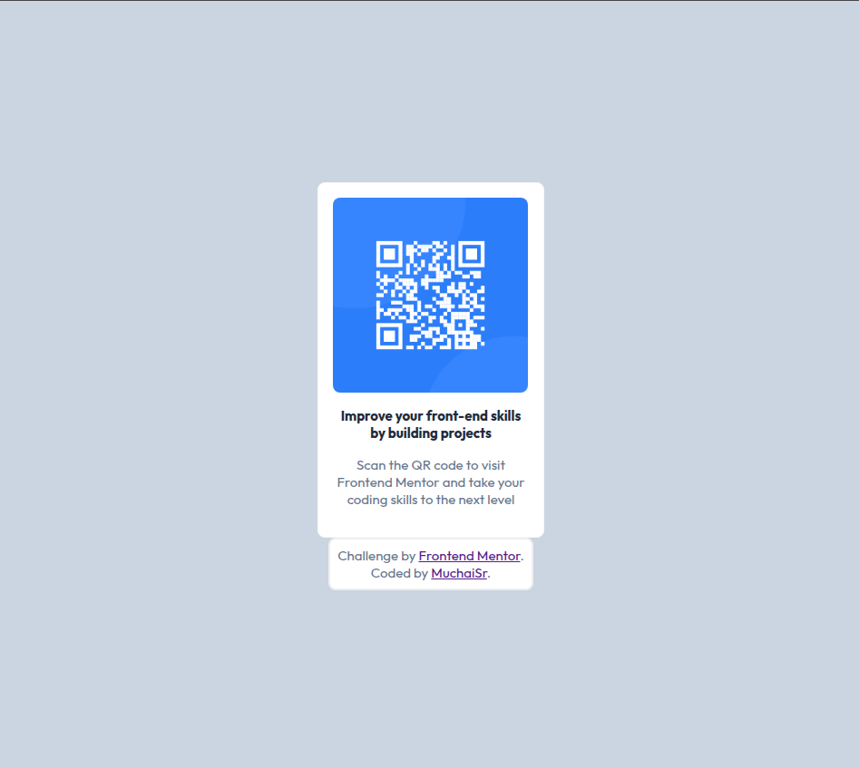

# Frontend Mentor - QR code component solution

This is a solution to the [QR code component challenge on Frontend Mentor](https://www.frontendmentor.io/challenges/qr-code-component-iux_sIO_H). Frontend Mentor challenges help you improve your coding skills by building realistic projects. 

## Table of contents

- [Overview](#overview)
  - [Screenshot](#screenshot)
- [My process](#my-process)
  - [Built with](#built-with)
  - [Continued development](#continued-development)

## Overview

### Screenshot

This is the first project of many that I intend on creating from the frontendmentor learning path. This project involved the creation of a qr-code component and this has been done utilising html and CSS. This is the screenshot of the final qr-code component product.

## My process

### Built with

- Semantic and non-semantic HTML5 markup
- CSS custom properties
- Flexbox

### Continued development

For my continued development, I would like to get more comfortable with the flex declarations, specifically the flex-basis declaration as I seem to struggle to understand how flex-basis affects the overall style of the webpage.

I shall continue studying and practicing this aspect of CSS.